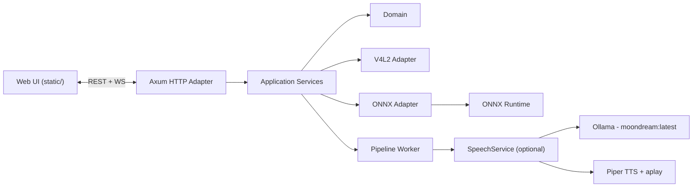

# YOLO V4L2 ONNX Dashboard (Rust)

[](https://www.rust-lang.org/)
[](https://github.com/tokio-rs/axum)
[](https://github.com/pykeio/ort)
[](#license)

**Repo sugerido:** `yolo-v4l2-onnx-dashboard`  
**Crate:** `yolo_backend_hex`

---

## ES — Español

### Qué es
Aplicación en **Rust** con arquitectura **hexagonal** (Domain + Application + Adapters) que:

- Captura vídeo desde cámara **V4L2** (Linux).
- Ejecuta inferencia **YOLO en ONNX Runtime** (CPU o GPU CUDA si está disponible).
- Publica un **dashboard web** (UI estática) con:
  - streaming por **WebSocket** (JPEG + metadatos JSON),
  - configuración dinámica de cámara e inferencia,
  - explorador de archivos para seleccionar modelos `.onnx`.
- (Opcional) Narra una descripción breve de la escena usando **Ollama (moondream:latest)** y **Piper TTS**.

### Arquitectura (Mermaid — compatible con GitHub)
```mermaid
flowchart LR
  UI["Web UI (static/)"]
  HTTP["Axum HTTP Adapter"]
  APP["Application Services"]
  DOM["Domain"]
  V4L2["V4L2 Adapter"]
  ONNX["ONNX Adapter"]
  ORT["ONNX Runtime"]
  PIPE["Pipeline Worker"]
  SPEECH["SpeechService (optional)"]
  OLLAMA["Ollama - moondream:latest"]
  PIPER["Piper TTS + aplay"]

  UI <--> |"REST + WS"| HTTP
  HTTP --> APP
  APP --> DOM
  APP --> V4L2
  APP --> ONNX
  ONNX --> ORT
  APP --> PIPE
  PIPE --> SPEECH
  SPEECH --> OLLAMA
  SPEECH --> PIPER
````

---

## Requisitos

### Sistema

* Linux con **V4L2** (cámaras típicamente en `/dev/video*`).
* `alsa-utils` (para `aplay`) si quieres voz.
* Rust toolchain (stable).

### Dependencias clave (incluidas vía Cargo)

* `axum` (REST + WebSocket)
* `tower-http` (CORS, trazas, estáticos)
* `v4l` (captura V4L2)
* `ort` (ONNX Runtime; con `download-binaries` y `cuda`)
* `image`, `ndarray`, `reqwest`, `serde`

> Nota ONNX Runtime: el crate `ort` usa `download-binaries`, por lo que en la mayoría de entornos no necesitas instalar ONNX Runtime del sistema. Para CUDA, sí necesitarás stack NVIDIA/CUDA compatible.

---

## Modelos: qué se usa y cómo instalar/descargar

### 1) Modelo YOLO en ONNX (`.onnx`)

El backend espera un archivo ONNX (por ejemplo `models/yolo11n.onnx`, o cualquier otro `.onnx` compatible con la salida esperada).

**Opción A — Exportar desde Ultralytics (recomendado)**

1. Instala Ultralytics:

   ```bash
   python3 -m pip install -U ultralytics
   ```
2. Exporta a ONNX:

   ```bash
   yolo export model=yolo11n.pt format=onnx imgsz=640
   ```
3. Copia el `.onnx` a una ruta local (p.ej. `./models/yolo11n.onnx`) y selecciónalo desde el explorador del dashboard.

**Opción B — Usar un `.onnx` ya exportado**

* Coloca el archivo `.onnx` en el host y apunta a su ruta con el explorador (`/api/files`) o la API (`/api/config`).

**Clases**

* El motor incluye una lista de clases tipo **COCO** en español (p.ej. “persona”, “coche”, “perro”…). Si tu `.onnx` es de otro dataset, deberás adaptar labels en el motor.

---

### 2) VLM opcional: Ollama + `moondream:latest`

Si activas el flujo de voz (está integrado en el pipeline), el sistema:

* Verifica Ollama en `http://localhost:11434/api/tags`
* Envía frames JPEG a `http://localhost:11434/api/generate`
* Usa `model = "moondream:latest"` y un prompt corto para describir la imagen

**Instalar Ollama (Linux)**

```bash
curl -fsSL https://ollama.com/install.sh | sh
```

**Arrancar servicio**

```bash
ollama serve
```

**Descargar el modelo**

```bash
ollama pull moondream:latest
```

> Nota: el código usa `http://localhost:11434` y `moondream:latest` (hard-coded). Si necesitas parametrizar host/modelo, la mejora natural es exponerlo en configuración.

---

### 3) TTS opcional: Piper + `aplay`

El ejecutable y el modelo de voz se esperan en:

* `./piper_voice/piper/piper` (binario)
* `./piper_voice/en_US-lessac-medium.onnx` (modelo de voz)

**Instala el reproductor**

```bash
sudo apt-get update
sudo apt-get install -y alsa-utils
```

**Descarga Piper (binario)**

* Descarga un release para Linux x64 desde el repositorio de Piper y descomprímelo.
* Coloca el binario final en `./piper_voice/piper/piper` y asegúrate de que es ejecutable:

  ```bash
  chmod +x ./piper_voice/piper/piper
  ```

**Descarga una voz**

* Descarga una voz ONNX (por ejemplo `en_US-lessac-medium.onnx`) y colócala en:

  ```text
  ./piper_voice/en_US-lessac-medium.onnx
  ```

---

## Ejecución

### 1) Compilar

```bash
cargo build --release
```

### 2) Ejecutar

```bash
RUST_LOG=info cargo run --release
```

Por defecto:

* Servidor: `http://0.0.0.0:8090`
* UI estática servida desde: `./static`

Abre en tu navegador:

* `http://localhost:8090`

---

## API (REST)

### GET `/api/cameras`

Lista cámaras disponibles.

### GET `/api/cameras/{index}/modes`

Lista formatos / resoluciones / FPS soportados.

### GET `/api/cameras/{index}/controls`

Lee controles (exposición, ganancia, etc.).

### POST `/api/cameras/{index}/controls`

Actualiza controles.

### GET `/api/config`

Devuelve configuración por defecto (cámara + inferencia).

### POST `/api/config`

Configura pipeline (cámara + modelo + parámetros YOLO).

**Ejemplo**

```bash
curl -X POST http://localhost:8090/api/config \
  -H "Content-Type: application/json" \
  -d '{
    "camera_path": "/dev/video0",
    "fourcc": "MJPG",
    "width": 1280,
    "height": 720,
    "fps": 30,
    "model_name": "yolo11n",
    "onnx_path": "./models/yolo11n.onnx",
    "yolo": {
      "input_size": 640,
      "conf_threshold": 0.25,
      "iou_threshold": 0.45,
      "max_detections": 100
    }
  }'
```

### GET `/api/files?path=...`

Explorador de archivos para seleccionar `.onnx` desde la UI.

---

## Streaming (WebSocket)

### WS `/ws/stream`

El servidor envía, por cada frame, un par de mensajes:

1. **Texto JSON** con metadatos:

```json
{
  "type": "frame_meta",
  "meta": {
    "width": 1280,
    "height": 720,
    "infer_ms": 7.2,
    "fps_est": 29.8,
    "detections": [
      {"x1": 10.0, "y1": 20.0, "x2": 200.0, "y2": 220.0, "score": 0.91, "class_id": 0, "label": "persona"}
    ]
  }
}
```

2. **Binario** con el JPEG del frame.

---

## Seguridad y operación

* Este proyecto sirve UI + API y expone un explorador de archivos. **No lo publiques tal cual en Internet** sin autenticación, control de rutas y endurecimiento (CORS, allowlist de directorios, etc.).
* Si abres `0.0.0.0:8090` en una LAN, cualquiera en la red podría acceder.

---

## Roadmap sugerido

* Parametrizar `OLLAMA_URL`, `MODEL_NAME` y rutas de Piper por configuración.
* Añadir autenticación (token) y allowlist de rutas para `/api/files`.
* Hacer hot-reload seguro del modelo ONNX (pool/arc swap).
* Métricas Prometheus (fps, infer_ms, dropped frames).

---

## Contribuir

PRs y issues son bienvenidos. Si propones cambios, intenta mantener:

* Dominio sin dependencias de infraestructura
* Servicios de aplicación como casos de uso
* Adaptadores aislando V4L2 / ONNX / HTTP

---

## License

MIT

---

---

## EN — English

### What this is

A **Rust** application with **hexagonal architecture** (Domain + Application + Adapters) that:

* Captures video from **V4L2** cameras (Linux).
* Runs **YOLO inference in ONNX Runtime** (CPU or CUDA GPU when available).
* Serves a **web dashboard** (static UI) with:

  * **WebSocket** streaming (JPEG + JSON metadata),
  * live camera + inference configuration,
  * file browser for selecting `.onnx` models.
* (Optional) Speaks a short scene description using **Ollama (moondream:latest)** + **Piper TTS**.

### Architecture (Mermaid — GitHub compatible)



---

## Requirements

### System

* Linux with **V4L2** (typically `/dev/video*`).
* `alsa-utils` (`aplay`) if you want voice output.
* Rust toolchain (stable).

### Key dependencies (via Cargo)

* `axum` (REST + WebSocket)
* `tower-http` (CORS, tracing, static files)
* `v4l` (V4L2 capture)
* `ort` (ONNX Runtime; `download-binaries` + `cuda`)
* `image`, `ndarray`, `reqwest`, `serde`

> ONNX Runtime note: with `download-binaries`, system-wide ORT is usually not required. CUDA needs a compatible NVIDIA/CUDA stack.

---

## Models: what’s used and how to install/download

### 1) YOLO ONNX model (`.onnx`)

The backend expects a YOLO ONNX file (e.g. `./models/yolo11n.onnx`) compatible with the runtime output the engine parses.

**Option A — Export with Ultralytics (recommended)**

```bash
python3 -m pip install -U ultralytics
yolo export model=yolo11n.pt format=onnx imgsz=640
```

**Option B — Use a pre-exported `.onnx`**
Place the `.onnx` on disk and select it via the UI file browser (`/api/files`) or POST `/api/config`.

**Classes**
The engine ships with a **COCO-like** label list (Spanish strings). If your model uses a different dataset, update labels in the engine.

---

### 2) Optional VLM: Ollama + `moondream:latest`

The speech pipeline checks:

* `http://localhost:11434/api/tags`
  and sends frames to:
* `http://localhost:11434/api/generate`

**Install Ollama (Linux)**

```bash
curl -fsSL https://ollama.com/install.sh | sh
```

**Start the daemon**

```bash
ollama serve
```

**Pull the model**

```bash
ollama pull moondream:latest
```

---

### 3) Optional TTS: Piper + `aplay`

Expected paths:

* `./piper_voice/piper/piper`
* `./piper_voice/en_US-lessac-medium.onnx`

Install audio playback:

```bash
sudo apt-get update
sudo apt-get install -y alsa-utils
```

Download Piper binary from releases, place it at `./piper_voice/piper/piper`, then:

```bash
chmod +x ./piper_voice/piper/piper
```

Download a voice ONNX model and place it at:

```text
./piper_voice/en_US-lessac-medium.onnx
```

---

## Run

Build:

```bash
cargo build --release
```

Run:

```bash
RUST_LOG=info cargo run --release
```

Defaults:

* Server: `http://0.0.0.0:8090`
* Static UI: `./static`

---

## REST API

* `GET /api/cameras`
* `GET /api/cameras/{index}/modes`
* `GET /api/cameras/{index}/controls`
* `POST /api/cameras/{index}/controls`
* `GET /api/config`
* `POST /api/config` (configure pipeline)
* `GET /api/files?path=...`

---

## WebSocket stream

* `WS /ws/stream`
  For each frame:

1. JSON text message with metadata
2. binary JPEG payload

---

## Security

Do not expose this as-is to the public Internet (file browsing + unauthenticated API). Add auth + path allowlisting + hardening first.

---

## License

MIT

---

---

## CA — Català

### Què és

Aplicació en **Rust** amb arquitectura **hexagonal** (Domain + Application + Adapters) que:

* Captura vídeo des de càmera **V4L2** (Linux).
* Executa inferència **YOLO amb ONNX Runtime** (CPU o CUDA GPU si està disponible).
* Serveix un **dashboard web** (UI estàtica) amb:

  * streaming per **WebSocket** (JPEG + metadades JSON),
  * configuració dinàmica de càmera i inferència,
  * explorador d’arxius per seleccionar models `.onnx`.
* (Opcional) Narra una descripció breu de l’escena amb **Ollama (moondream:latest)** i **Piper TTS**.

### Arquitectura (Mermaid — compatible amb GitHub)


---

## Requisits

### Sistema

* Linux amb **V4L2** (`/dev/video*`).
* `alsa-utils` (`aplay`) si vols veu.
* Rust toolchain (stable).

### Dependències (via Cargo)

* `axum`, `tower-http`, `v4l`, `ort`, `image`, `ndarray`, `reqwest`, `serde`

---

## Models: què s’utilitza i com instal·lar/baixar

### 1) Model YOLO ONNX (`.onnx`)

**Opció A — Exportar amb Ultralytics**

```bash
python3 -m pip install -U ultralytics
yolo export model=yolo11n.pt format=onnx imgsz=640
```

**Opció B — Usar un `.onnx` ja exportat**

* Desa el `.onnx` al disc i selecciona’l via UI (`/api/files`) o configuració (`/api/config`).

---

### 2) VLM opcional: Ollama + `moondream:latest`

Instal·lació (Linux):

```bash
curl -fsSL https://ollama.com/install.sh | sh
```

Servei:

```bash
ollama serve
```

Model:

```bash
ollama pull moondream:latest
```

---

### 3) TTS opcional: Piper + `aplay`

Instal·la reproductor:

```bash
sudo apt-get update
sudo apt-get install -y alsa-utils
```

Rutes esperades:

* `./piper_voice/piper/piper`
* `./piper_voice/en_US-lessac-medium.onnx`

---

## Execució

```bash
cargo build --release
RUST_LOG=info cargo run --release
```

Per defecte: `http://localhost:8090`

```

### Referencias usadas (para que tengas trazabilidad, no es parte del README)
- Rutas/puerto/configuración y dependencias: :contentReference[oaicite:0]{index=0} :contentReference[oaicite:1]{index=1} :contentReference[oaicite:2]{index=2} :contentReference[oaicite:3]{index=3}  
- Ollama (instalación Linux y modelo moondream): :contentReference[oaicite:4]{index=4}  
- Export ONNX con Ultralytics: :contentReference[oaicite:5]{index=5}  
- Piper (binarios/releases) y `alsa-utils`: :contentReference[oaicite:6]{index=6}
::contentReference[oaicite:7]{index=7}
```

